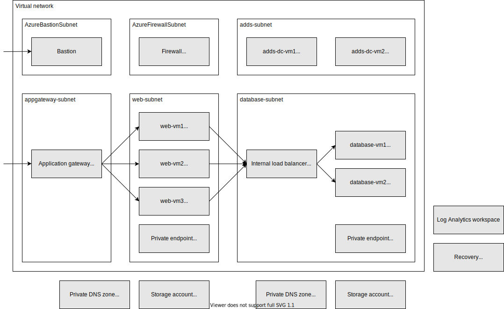

# Role playing PoC

## Deploy

You can deploy this template from the following:

[](https://portal.azure.com/#create/Microsoft.Template/uri/https%3A%2F%2Fraw.githubusercontent.com%2Ftksh164%2Fazure-demo-scripts-templates%2Fmaster%2Farm-templates%2FDemo-RolePlaying-PoC%2Fiaas%2Ftemplate.json)

Also you can deploy this template using the `deploy.ps1` script. It can specify the resource group via `-ResourceGroupName` parameter.

```
PS > .\deploy.ps1
```

## Template overview



### Deployment

- Resource group: `demo-roleplaying-poc`
    - VNet: `poc-vnet`
        - Subnet: `adds-subnet`
            - Network security group: `adds-subnet-nsg`
            - Virtual Machine: `adds-dc-vm1`
                - OS disk: `adds-dc-vm1-osdisk`
                - Data disk: `adds-dc-vm1-datadisk1`
            - Virtual Machine: `adds-dc-vm2`
                - OS disk: `adds-dc-vm2-osdisk`
                - Data disk: `adds-dc-vm2-datadisk1`
        - Subnet: `database-subnet`
            - Network security group: `database-subnet-nsg`
            - Private endpoint: `wsfccloudwitness-privateendpoint`
            - Internal load balancer: `database-lbi`
                - Virtual Machine: `database-vm1`
                    - OS disk: `database-vm1-osdisk`
                    - Data disk: `database-vm1-datadisk1`
                - Virtual Machine: `database-vm2`
                    - OS disk: `database-vm2-osdisk`
                    - Data disk: `database-vm2-datadisk1`
        - Subnet: `web-subnet`
            - Network security group: `web-subnet-nsg`
            - Private endpoint: `imagestore-privateendpoint`
            - Virtual Machine: `web-vm1`
                - OS disk: `web-vm1-osdisk`
                - Data disk: `web-vm1-datadisk1`
            - Virtual Machine: `web-vm2`
                - OS disk: `web-vm1-osdisk`
                - Data disk: `web-vm1-datadisk1`
            - Virtual Machine: `web-vm3`
                - OS disk: `web-vm1-osdisk`
                - Data disk: `web-vm1-datadisk1`
        - Subnet: `appgateway-subnet`
            - Network security group: `appgateway-subnet-nsg`
            - Application gateway: `web-waf-agw`
                - Public IP address: `web-waf-agw-ip`
        - Subnet: `AzureFirewallSubnet`
            - Firewall: `firewall`
                - Public IP address: `firewall-ip`
        - Subnet: `AzureBastionSubnet`
            - Network security group: `bastion-subnet-nsg`
            - Bastion: `bastion`
                - Public IP address: `bastion-ip`
    - Route table: `firewall-route`
        - Associated subnets: `adds-subnet`, `database-subnet`
    - Storage account: `wsfccloudwitness####`
    - Private DNS zone: `privatelink.blob.core.windows.net`
    - Storage account: `imagestore####`
    - Private DNS zone: `privatelink.file.core.windows.net`
    - Log Analytics workspace: `monitor####-law`
    - Recovery Services vault: `backup####-rsv`


### Not deployment

- The guest OS configurations.
- The internal load balancer is not configured.
- The application gateway is not configured.
- The Recovery Services vault is not configured.
- The Log Analytics workspace is not configured.

## Notes

- The some resources (e.g. Recovery Services vault) are cannot deploy with same resource group name and same resource name within 24 hours even if it's deleted.
- The deploy.ps1 script needs [Az module](https://www.powershellgallery.com/packages/Az/).
